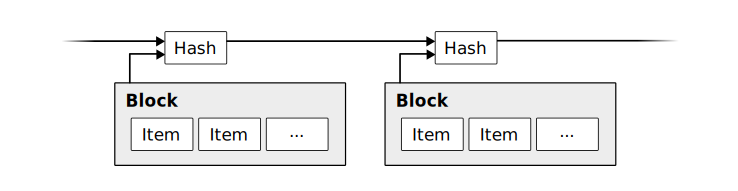
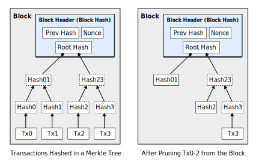
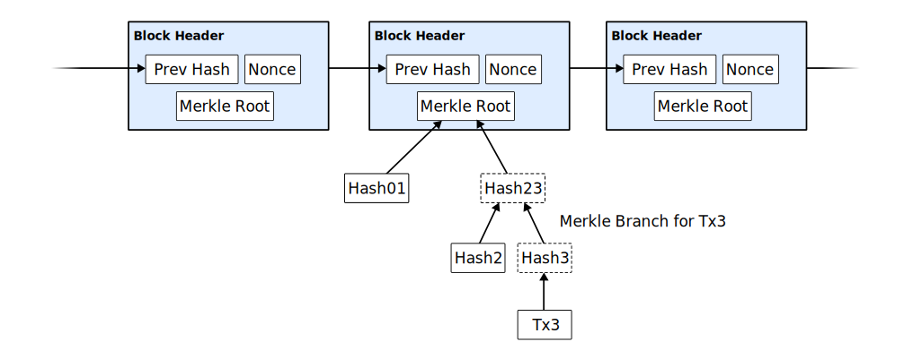

:title: Blockchain data structures
:data-transition-duration: 300
:css: css/presentation.css

----

Blockchain Data Structures
==========================

.. image:: blockchain-3212304_1920.jpg
    :height: 341px
    :width: 800px

Darren Wurf

----

Introduction
========================================================================

So I had some questions...

 * What are blockchains?
 * What makes them different?
 * How do they work?

.. note::

    Something to do with cryptocurrency?

----

Introduction
========================================================================

So I had some questions...

 * **What are blockchains?**
 * What makes them different?
 * How do they work?

----

Blockchain
========================================================================

A **blockchain** is a **shared ledger** where each new **block of transactions** is signed with a **Nakamoto signature**.

.. note::

    Two concepts: Shared ledger, and Nakamoto signature

----

Shared ledger
========================================================================

The shared ledger can be seen as a **series of blocks**, each of which is presented for signature when it is created.  Each block consists of a **set of transactions** built on the previous set.

Each block changes the **state of the accounts** by moving money around; we can create the next block by filling it with transactions, and signing it with a Nakamoto signature. 

.. note::
    1. Executive view: A blockchain is a shared decentralized ledger, enabling business disintermediation and trustless interactions, thereby lowering transaction costs

    2. A blockchain is a peer-to-peer protocol for trust-less  execution  and  recording  of  transactions  secured by asymmetric cryptography in a consistent and immutable chain of blocks – the blockchain developers and technology view.
    3. A blockchain is a shared append-only distributed database with full replication and a cryptographic transaction permissioning model – the IT architect and data management view.

----

Nakamoto signature
========================================================================

A Nakamoto signature is a device to allow a group to **agree on a shared document**. To eliminate the potential for inconsistencies (disagreement), the group **engages in a lottery** to pick one person's version as the **one true document**.

The lottery is effected by all members of the group racing to create the **longest hash** over their copy of the document.  The longest hash **wins the prize** and also becomes a verifiable 'token' of the one true document for members of the group: the Nakamoto signature. 

----

Darren's interpretation ¯\\_(ツ)_/¯
========================================================================

Blockchains provide a timestamped ledger with **shared-write** capability to entities who **do not trust each other**.

----

Questions
========================================================================

So I had some questions...

 * What are blockchains?
 * **What makes them different?**
 * How do they work?

.. note::

    Is it a database?
    Maybe I should compare blockchains to a database

----

Compared to traditional databases
====================================================

Properties of blockchains:

* Distributed
* Secure
* Append-only
* Eventually consistent

.. note::
     * Support for cryptographic controls down to the individual record level
        * Participants can publish cryptographic proofs
        * Network rules prevent misbehaviour, such as double spending
        * Published blocks can't be modified
     * Log-structured, immutable, append-only, peer-to-peer
     * ACID compliant? **No**: see `SALT <http://www.ise.tu-berlin.de/fileadmin/fg308/publications/2017/2017-tai-eberhardt-klems-SALT.pdf>`_
     * CAP theorem: Available and Partition Tolerant - eventually consistent - miners vote using Proof of Work

----

Compared to traditional databases
====================================================

Downsides of blockchains

* Cost
* Latency
* Throughput

.. note::
     * Very high cost per transaction (power consumption / specialised compute)
     * Dependent on expensive consensus tools, e.g. through Proof of Work (mining)
     * Very high latency for transaction confirmation (e.g. 6 blocks / 1hr)
     * Low capacity and throughput
       * Bitcoin is limited to 1MB every 10 minutes, averaging about 7 transactions per second
     * Requires incentives to sustain the network, e.g. block reward

----

Questions
========================================================================

So I had some questions...

 * What are blockchains?
 * What makes them different?
 * **How do they work?**

.. note::

    Maybe looking at the data structures will help me understand

----

The data structures
===================

 * Chain
 * Blocks
 * Mempool
 * Transactions
 * Merkle trees

----

The chain
=========

.. image:: proof-of-work.svg

* Each block contains the hash of the previous block
* Blocks contain a header and some transaction data. 

----

The chain
=========

.. image:: proof-of-work.svg

* Miners increment the nonce to change the hash of the current block
* A block is published once a hash is found that meets the difficulty threshold
* For example, if the difficulty is ``0x00001b...`` the miners must find a hash with lower starting bits

----

The block
================

Bitcoin block structure
-----------------------

+---------+---------------+----------------+-------+-------+--------+
| version | hashPrevBlock | hashMerkleRoot | nTime | nBits | nNonce |
+---------+---------------+----------------+-------+-------+--------+
| tx0 (coinbase)          | tx1..n                                  |   
+---------+---------------+----------------+-------+-------+--------+

The first transaction is called the coinbase and is allowed to create new bitcoin.

.. code:: c++

    // Bitcoin block header
    int32_t nVersion;        // Block version
    char[32] hashPrevBlock;  // sha256
    char[32] hashMerkleRoot; // sha256
    uint32_t nTime;          // Unix timestamp
    uint32_t nBits;          // Difficulty target
    uint32_t nNonce;         // Increment nonce to "mine" (change the hash)

.. note::

    Merkle trees: A kind of "cryptographic summary" of the data in the block.
                  They allow us to hash only the headers.

----

The mempool
================

.. image:: mempool.png

1. Participant signs transaction and broadcasts it to nodes
2. Transaction `sits in the mempool <https://blockchain.info/unconfirmed-transactions>`_ until a miner picks it up
3. Winning miner includes transaction in their published block

.. note::
    * To publish data on the blockchain, people sign a transaction and broadcast it to nodes on the network
    * The published document must satisfy the network rules (e.g. no double-spend)
    * There is often a fee to publish, paid to the miners
    * Nodes store valid, unconfirmed transactions in the **mempool**

----

The transaction
================

.. image:: combining-splitting-value.svg

A transaction contains:
 * One or more inputs (utxo)
 * One or more outputs
 * Some addresses and signatures

.. note::
    Inputs: Source code doesn't contain "coins" as a concept, uses utxo

    * arbitrary value

    Outputs include change from the transaction

----

The transaction
================

.. image:: transactions.svg

* Transactions track the history of a "coin" (utxo)
* Coins are passed from owner to owner

.. note::
    Cryptographic proof of ownership

    Owner 1 wants to send to owner 2:

    * First block: Owner 1's proof that owner 0 send them the coin

    * Second block: Owner 1 creates the transaction, including:

    ** Recipient's public key

    ** Owner 1's Digital Signature of:

    ** * Proof of ownership (previous transaction, first block)

    ** * Recipient's public key

    Lose your private key -> lose your money

    Private key stolen -> lose your money
    

----

The Merkle Tree
================

+---------+---------------+--------------------+-------+-------+--------+
| version | hashPrevBlock | **hashMerkleRoot** | nTime | nBits | nNonce |
+---------+---------------+--------------------+-------+-------+--------+

* The merkle tree summarises the data (transactions) stored in the block
* The root of the tree is stored in the block header
* Only the header of the block is hashed by miners, individual transactions are not

.. note::
    Complex topic. Important points:
    * Only the block header is hashed
    * Transactions can be pruned
    * Merkle tree is magic that can prove a transaction belongs to a block header

----

The Merkle Tree
================
.. image:: Hash_Tree.svg
    :height: 509px
    :width: 800px

* Leaf nodes are the hash of the data blocks
* The intermediate nodes are the hash of their children
* The root is stored in the block header

----

Compacting old blocks
================================

* Historic transactions can be pruned to save space
* Nodes can store just the parent node for branches they aren't interested in
* Blocks and transactions can still be validated using the parent nodes

----

Simplified Payment Verification
================================

* Full nodes store the entire blockchain history
* SPV allows users to use the blockchain without storing the full history
* A mobile wallet can download just the block headers and relevant branches

----

Learnings
================================

* Blockchains are **weird!**
* Blockchains suck at **storing data**
* Blockchains are great at **verifying history**

----

Links
========

* Whitepaper: https://nakamotoinstitute.org/bitcoin/ (read the references too!)
* Explanantion: https://www.vpnmentor.com/blog/ultimate-guide-bitcoin/
* Protocol structures: https://en.bitcoin.it/wiki/Protocol_documentation#Common_structures
* Properties of blockchains: SALT: http://www.ise.tu-berlin.de/fileadmin/fg308/publications/2017/2017-tai-eberhardt-klems-SALT.pdf
* Real-time transaction view: https://blockchain.info/unconfirmed-transactions
* Real-time transaction visualisation: https://bitbonkers.com/
